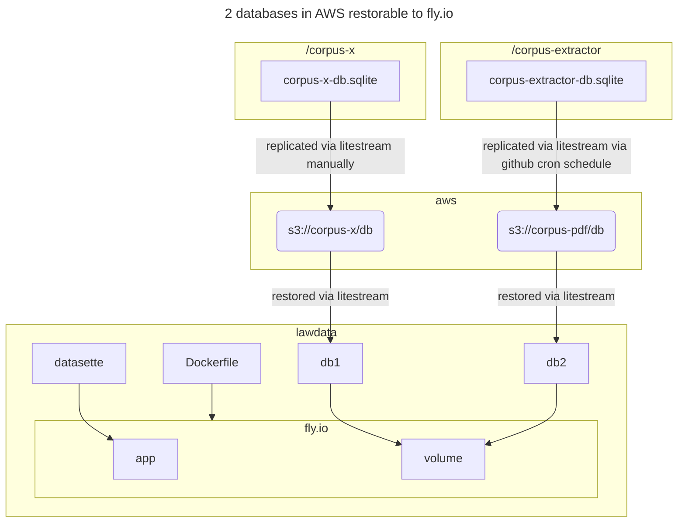

# Overview

[lawData](https://lawdata.xyz) is an authenticated datasette (`0.64.1`) instance on fly.io deployed via litestream and docker, covering databases created from `/corpus-extractor` and `/corpus-x`.

repo | dependencies | src | notes
--:|:--|:--|:--
_corpus-extractor_ (private) | [corpus-unpdf](https://mv3.dev/corpus-unpdf), _corpus-sitemap_ (private) | [sc](https://sc.judiciary.gov.ph) | pdf files
[corpus-x](https://mv3.dev/corpus-x) | [corpus-pax](https://mv3.dev/corpus-pax), [corpus-base](https://mv3.dev/corpus-base) | [sc-elib](https://elibrary.judiciary.gov.ph) | converted md / yaml files

## Litestream

If database cannot be found in the client device:

```sh
export LITESTREAM_ACCESS_KEY_ID=xxx
export LITESTREAM_SECRET_ACCESS_KEY=yyy
litestream restore -if-db-not-exists -o x.db s3://corpus-x/db  # will restore x.db sqlite from s3://corpus-x/db using CLI
```

## Flow



## Folder Structure

```sh
├── app
│   ├── queries # see metadata.yml referencing app/queries in relation to datasette-query-files
│   │   ├── x # for x-based .sql queries
│   │   ├── pdf # for pdf-based .sql queries
│   ├── plugins
│   ├── scripts
│   │   ├── run.sh # called via Dockerfile CMD
│   ├── metadata.yml
│   ├── requirements.txt
│   ├── main.py # contains the commands implemented in run.sh
├── data # see main.py in tandem with fly.toml which will look for / place .db files here
├── Dockerfile

# while in the root folder, ensure that requirements.txt inside `app/` is updated via:
poetry export -f requirements.txt -o app/requirements.txt --without-hashes
```

## Docker Entrypoint

The Dockerfile does **not** change directories via `WORKDIR`.

This is because of `run.sh` which references 2 top-level directories:

Directory | Description
--:|:--
`/app` | Initialized with `fly apps create`
`/data` | Separate volume created via `fly volumes create` and then attached to the app created via `fly apps create`.

```sh
# gist of run.sh
python -m app x-restore-db # creates a new /data/x.db
python -m app pdf-restore-db # creates a new /data/pdf.db
datasette serve --immutable data/pdf.db data/x.db \ # see data folder
  --host 0.0.0.0 \
  --port 8080 \ # same port in Dockerfile
  --metadata app/metadata.yml \ # see app folder
  --plugins-dir app/plugins \ # see app folder
  --setting default_cache_ttl 86400 \
  --setting sql_time_limit_ms 20000 \
  --setting allow_download off \
  --cors
```

## Assumptions

1. sqlite databases are existing in aws s3 buckets.
2. Credentials `LITESTREAM_ACCESS_KEY_ID` and `LITESTREAM_SECRET_ACCESS_KEY` are available to access aws.
3. `litestream` is installed to transfer the database/s to the docker container.
4. [Docker for Mac](https://docs.docker.com/desktop/install/mac-install/) is installed, updated, and running.
5. valid Dockerfile in root directory and the proper versions of the prerequisite apps are configured:
    1. `python`, 3.11
    2. `litestream`, 0.39
    3. `sqlite` 3.40
6. An updated `/app/requirements.txt` file is generated that will be used by the Dockerfile
